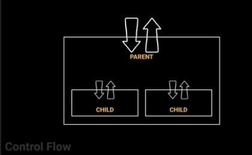
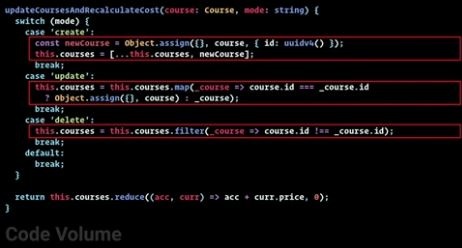

# Enterprise Typescript
- https://github.com/onehungrymind/fem-enterprise-patterns 
- https://stackblitz.com/edit/micro-refactor-example
- https://stackblitz.com/edit/typescript 

### Complexity

Expand

1. Axis of Evil
    1. Antidote is simplicity
    1. Change the way you think
1. Biggest problem
    1. complexity
1. Bottle neck
    1. handling of state
    1. code volume
    1. flow of control
1. Control Flow
    1. 
1. Code Volume
    1. 
        1. reuse is difficult
1. Enterprise Mindset
    1. Trying to make scalable code... that is...
        1. control flow
        1. code volume
        1. 

### Object Oriented Programming

Expand

### Decisions / Conditionals

Expand

### Collections / Iterators

Expand

### Time Management

Expand

### Distributed Complexity

Expand

